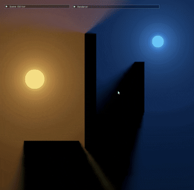

# Radiance Cascades

A C++20, Direct3D 11, and HLSL exploration of **Radiance Cascades**: a method for real-time global illumination in 2D scenes with many light sources.
It aims to deliver visually convincing lighting for large emissive scenes while keeping global illumination practical to render in real time.



## How It Works

Radiance Cascades distributes lighting samples across multiple distance ranges:

1. The scene stores obstacle and emission data in GPU textures.
2. A compute-shader Jump Flooding Algorithm (JFA) builds an approximate distance field from the obstacle texture, allowing rays to skip across empty space with fewer marching steps.
3. Each cascade ray-marches its own distance interval using that distance field.
4. Cascades form a hierarchy of distance ranges: farther cascades use more rays per probe, while their probes are placed farther apart.
5. A final gather pass reconstructs the displayed lighting from the final cascade.

## Features

- **Texture-driven scene** — Obstacles and emission are stored in each texture.
- **GPU distance field** — Generates an obstacle distance field for faster ray marching. A compute shader is used to generate the distance field.
- **Texture ping-pong** — The distance field shader and the cascade rendering shader alternate between two textures to avoid unnecessary memory usage.
- **Pre-averaged ray storage** — Four traced rays are averaged into one stored result, reducing cascade texture storage and texture fetches to 1/4.
- **Automatic cascade count** — The cascade count is calculated from the required scene/viewport coverage and interval length.
- **Interactive scene editor** — Left click paints emissive obstacles, right click paints obstacles, and middle click erases them.
- **Incremental updates** — Editing uploads only the changed texture region.
- **Resize handling** — The scene and viewport-dependent GPU resources, including cascade textures, are resized to match window-size changes.
- **Debug controls** — Dear ImGui controls expose display modes, cascade inspection, and approximate video-memory information.

## Tech Stack

- C++20
- Win32
- Direct3D 11 / DXGI
- HLSL Shader Model 5.0
- CMake
- Dear ImGui

## Build

Requirements: Windows, a Visual Studio C++ toolchain with the Windows SDK, and CMake 4.2 or newer.

```powershell
cmake -S . -B build
cmake --build build --config Debug
.\build\Debug\RadianceCascades.exe
```

## References

- [ExileCon 2023 - Rendering Path of Exile 2](https://youtu.be/TrHHTQqmAaM?si=7ny4X1o0mI_8aazu)
- [GM Shaders Radiance Cascades](https://mini.gmshaders.com/p/radiance-cascades)
- [GM Shaders Radiance Cascades 2](https://mini.gmshaders.com/p/radiance-cascades2)
- [Radiance Cascades: A Novel Approach to Calculating Global Illumination](https://jason.today/rc)
- [YouTube: Exploring a New Approach to Realistic Lighting: Radiance Cascades](https://youtu.be/3so7xdZHKxw?si=9730FGlIDg1SXpRs)
